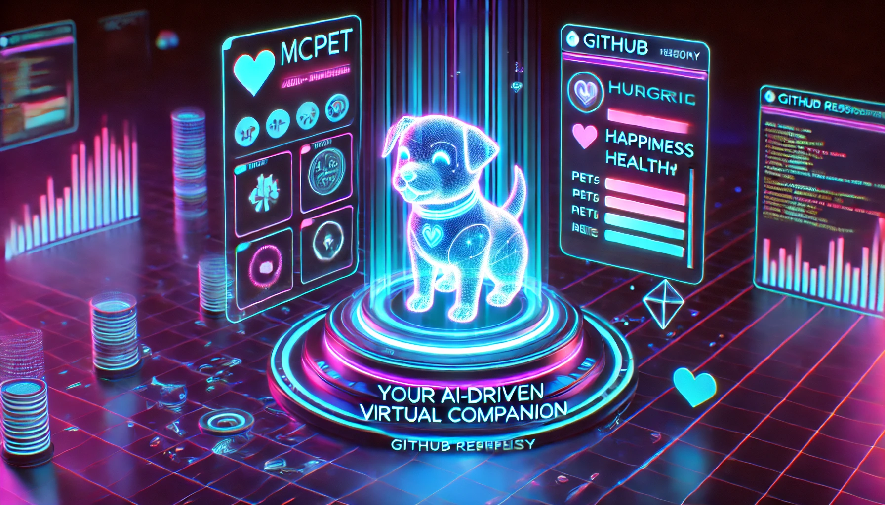

# MCPet



MCPet: A nostalgic virtual pet experience for the AI age! This [Model Context Protocol (MCP)](https://modelcontextprotocol.io/) server lets you adopt, nurture, and play with your very own digital companion that evolves based on your care. Feed them, clean them, play games together, and watch them grow from a baby to an adult. Your pet's stats change over time even when you're away - just like the classic Tamagotchi toys, but powered by modern AI through the Model Context Protocol. Adopt your digital friend today!

This is a TypeScript-based MCP server that implements a virtual pet simulation system. It demonstrates core MCP concepts by providing tools for pet care and interaction.

## Features

### Virtual Pet Types

- Choose from four pet types:
  - Cat - Slightly moody but lovable
  - Dog - Energetic and always happy to see you
  - Dragon - Unique and fiery personality
  - Alien - Mysterious and curious

### Pet Lifecycle

- Watch your pet evolve through four stages:
  - Baby - Small and vulnerable
  - Child - Growing and playful
  - Teen - Energetic and developing
  - Adult - Fully grown and wise

### Stats Management

- Care for your pet by managing five key stats:
  - Hunger - Keep your pet well-fed
  - Happiness - Play with your pet to keep them happy
  - Health - Overall wellbeing affected by other stats
  - Energy - Depletes with activity, replenishes with rest
  - Cleanliness - Regular baths keep your pet fresh

### Tools

- `create_pet` - Adopt a new pet with a custom name and type
- `check_pet` - View your pet's current status and stats
- `feed_pet` - Feed your pet with different food options:
  - Snack - Small hunger boost
  - Meal - Balanced nutrition
  - Feast - Maximum feeding (but can be unhealthy)
- `play_with_pet` - Play different games:
  - Ball - Light exercise
  - Chase - High energy fun
  - Puzzle - Mental stimulation
- `clean_pet` - Give your pet a bath to restore cleanliness
- `put_to_bed` - Let your pet sleep to restore energy

### Animations

- Dynamic ASCII art animations for each pet type and activity
- Randomized frames create a lively and engaging experience
- Special animations for:
  - Eating different foods
  - Playing various games
  - Bathing
  - Sleeping
  - Being sick
  - And more!

## Development

Install dependencies:

```bash
npm install
```

Build the server:

```bash
npm run build
```

For development with auto-rebuild:

```bash
npm run watch
```

## Installation

To use with Claude Desktop, add the server config:

On MacOS: `~/Library/Application Support/Claude/claude_desktop_config.json`
On Windows: `%APPDATA%/Claude/claude_desktop_config.json`

```json
{
  "mcpServers": {
    "mcpet": {
      "command": "node",
      "args": ["/path/to/mcpet/build/index.js"],
      "env": {
        "PET_DATA_DIR": "/path/to/writable/directory"
      }
    }
  }
}
```

Note: The `PET_DATA_DIR` environment variable specifies where pet data will be stored. Make sure this is a directory with write permissions.

### Debugging

Since MCP servers communicate over stdio, debugging can be challenging. We recommend using the [MCP Inspector](https://github.com/modelcontextprotocol/inspector):

```bash
npx @modelcontextprotocol/inspector node /path/to/mcpet/build/index.js
```

The Inspector will provide an interface for testing your pet interactions directly.

## Usage Examples

Ask Claude questions like:

- "Can you create a cat pet named Whiskers?"
- "How is my pet doing?"
- "Can you feed my pet a meal?"
- "I'd like to play chase with my pet"
- "My pet looks dirty, can you give it a bath?"
- "My pet seems tired, can you put it to bed?"
